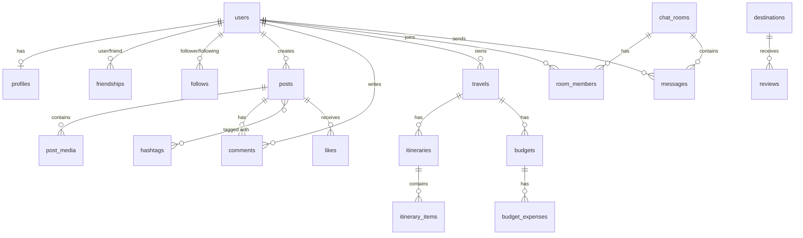

# 📋 PRD: 소셜 미디어 + 여행 플래너 통합 플랫폼

> **버전**: 1.0  
> **작성일**: 2025-02-23  
> **개발 기간**: 3개월 (12주)

---

## 1. 프로젝트 개요

### 1.1 목적

소셜 네트워크 기능과 여행 계획·공유·관리 기능을 결합한 **멀티 플랫폼 서비스**(Web + Mobile)를 설계·구현한다.

### 1.2 목표

- 실제 서비스 수준의 설계
- 포트폴리오 제출 가능 수준
- 면접에서 아키텍처 설명이 가능한 구조

### 1.3 기술 스택

| 구분 | 기술 |
|------|------|
| **Backend** | Spring Boot, Spring Security, JWT, JPA + QueryDSL, Spring WebSocket, RESTful API |
| **Frontend (Web)** | React, Axios, React Router, Context/Redux |
| **Mobile** | Flutter, REST API, WebSocket |
| **Database** | MySQL (정규화 ERD, 인덱싱) |

---

## 2. 요구사항 분석 및 기능 목록

### 2.1 소셜 미디어 기능

| ID | 기능 | 상세 | 우선순위 |
|----|------|------|----------|
| SM-01 | 프로필 관리 | 개인/비즈니스 프로필 생성·수정 | P0 |
| SM-02 | 친구/팔로우 | 친구 추가, 팔로우/언팔로우 | P0 |
| SM-03 | 게시물 작성 | 텍스트/이미지/동영상/링크 | P0 |
| SM-04 | 해시태그 | 콘텐츠 분류, 인기 해시태그·트렌드 조회 | P0 |
| SM-05 | 공개 범위 | 전체/친구/비공개 설정 | P0 |
| SM-06 | 피드 | 실시간 피드 제공 | P0 |
| SM-07 | 실시간 메시징 | 1:1 채팅, WebSocket 기반 | P0 |
| SM-08 | 좋아요/북마크 | (선택) 게시물 반응 | P1 |

### 2.2 여행 플래너 기능

| ID | 기능 | 상세 | 우선순위 |
|----|------|------|----------|
| TP-01 | 목적지 검색 | 여행지 검색 | P0 |
| TP-02 | 일정 관리 | 날짜별 일정 생성·수정·삭제 | P0 |
| TP-03 | 날씨 연동 | 실시간 날씨 정보 | P0 |
| TP-04 | 교통 정보 | 경로 및 교통편 | P0 |
| TP-05 | 예산 관리 | 예산 설정, 지출 추적 | P0 |
| TP-06 | 일정 공유 | 친구/공개 공유 | P0 |
| TP-07 | 리뷰 | 여행지 리뷰 작성·조회 | P0 |

### 2.3 공통 기능

| ID | 기능 | 상세 |
|----|------|------|
| CM-01 | 인증/인가 | JWT, Role 기반 접근 제어 |
| CM-02 | 알림 | (선택) 실시간 알림 |
| CM-03 | 검색 | (선택) 검색 최적화 |

---

## 3. ERD 및 도메인 모델 설계

### 3.1 도메인 구조 (DDD 스타일)

```
┌─────────────────────────────────────────────────────────────────┐
│                        Bounded Contexts                           │
├──────────────┬──────────────┬──────────────┬────────────────────┤
│   User       │   Social     │   Travel     │   Chat              │
│   Context    │   Context    │   Context    │   Context           │
├──────────────┼──────────────┼──────────────┼────────────────────┤
│ User         │ Post         │ Travel       │ ChatRoom            │
│ Profile      │ Comment      │ Itinerary    │ Message             │
│ Role         │ Hashtag      │ Budget       │ RoomMember          │
│ Friend       │ PostHashtag  │ Review       │                     │
│ Follow       │ Like         │ Destination  │                     │
└──────────────┴──────────────┴──────────────┴────────────────────┘
```

### 3.2 ERD 테이블 정의

#### User Context

| 테이블 | 설명 | 주요 컬럼 |
|--------|------|-----------|
| **users** | 사용자 계정 | id, email, password_hash, role, status, created_at |
| **profiles** | 프로필 (개인/비즈니스) | id, user_id, display_name, bio, profile_type, avatar_url |
| **friendships** | 친구 관계 | id, user_id, friend_id, status, created_at |
| **follows** | 팔로우 관계 | id, follower_id, following_id, created_at |

#### Social Context

| 테이블 | 설명 | 주요 컬럼 |
|--------|------|-----------|
| **posts** | 게시물 | id, user_id, content, visibility, created_at |
| **post_media** | 게시물 미디어 | id, post_id, media_type, url, sort_order |
| **comments** | 댓글 | id, post_id, user_id, content, parent_id, created_at |
| **hashtags** | 해시태그 | id, name, use_count |
| **post_hashtags** | 게시물-해시태그 매핑 | post_id, hashtag_id |
| **likes** | 좋아요 | id, user_id, target_type, target_id, created_at |
| **bookmarks** | 북마크 | id, user_id, post_id, created_at |

#### Travel Context

| 테이블 | 설명 | 주요 컬럼 |
|--------|------|-----------|
| **travels** | 여행 | id, user_id, title, start_date, end_date, visibility |
| **itineraries** | 일정 (날짜별) | id, travel_id, day_date, memo |
| **itinerary_items** | 일정 상세 | id, itinerary_id, destination, time, transport, memo |
| **budgets** | 예산 | id, travel_id, category, planned_amount, spent_amount |
| **budget_expenses** | 지출 내역 | id, budget_id, amount, description, expense_date |
| **reviews** | 여행지 리뷰 | id, user_id, destination_id, rating, content, created_at |
| **destinations** | 목적지 | id, name, lat, lng, region |

#### Chat Context

| 테이블 | 설명 | 주요 컬럼 |
|--------|------|-----------|
| **chat_rooms** | 채팅방 | id, room_type, created_at |
| **room_members** | 채팅방 멤버 | id, room_id, user_id, joined_at |
| **messages** | 메시지 | id, room_id, user_id, content, created_at, read_at |

### 3.3 ERD 관계 다이어그램 (Mermaid)



### 3.4 인덱스 전략 (대용량 고려)

| 테이블 | 인덱스 | 용도 |
|--------|--------|------|
| posts | (user_id, created_at DESC) | 사용자별 피드 조회 |
| posts | (visibility, created_at DESC) | 공개 피드 조회 |
| post_hashtags | (hashtag_id, post_id) | 해시태그별 게시물 검색 |
| hashtags | (name) UNIQUE | 해시태그 검색 |
| friendships | (user_id, friend_id) UNIQUE | 친구 조회 |
| follows | (follower_id, following_id) | 팔로우 목록 |
| messages | (room_id, created_at) | 채팅 히스토리 |
| itineraries | (travel_id, day_date) | 일정 조회 |

---

## 4. 인증/인가 설계

### 4.1 JWT 기반 인증 흐름

```
┌─────────┐     POST /auth/login      ┌─────────┐     JWT 발급      ┌─────────┐
│ Client  │ ────────────────────────> │  Auth   │ ───────────────>  │ Client  │
│(Web/Mob)│  {email, password}        │ Service │  Access + Refresh │         │
└─────────┘                           └─────────┘                   └─────────┘
      │                                     │
      │     Authorization: Bearer <token>   │
      │ ─────────────────────────────────> │
      │                                     v
      │                              ┌─────────────┐
      │                              │ JWT Filter  │
      │                              │ Validate    │
      │                              └──────┬──────┘
      │                                     │
      │                                     v
      │                              ┌─────────────┐
      │                              │ Controller  │
      │                              └─────────────┘
```

### 4.2 Role 정의

| Role | 설명 | 권한 |
|------|------|------|
| ROLE_USER | 일반 사용자 | 프로필, 게시물, 여행, 채팅 |
| ROLE_BUSINESS | 비즈니스 | USER + 비즈니스 프로필 |
| ROLE_ADMIN | 관리자 | 전체 관리 |

### 4.3 공개 범위 제어

| visibility | 접근 가능 |
|------------|-----------|
| PUBLIC | 모든 사용자 |
| FRIENDS | 친구만 |
| PRIVATE | 본인만 |

---

## 5. REST API 명세서

### 5.1 인증 API

| Method | Endpoint | 설명 |
|--------|----------|------|
| POST | `/api/auth/register` | 회원가입 |
| POST | `/api/auth/login` | 로그인 (JWT 발급) |
| POST | `/api/auth/refresh` | 토큰 갱신 |
| POST | `/api/auth/logout` | 로그아웃 |

### 5.2 사용자/프로필 API

| Method | Endpoint | 설명 |
|--------|----------|------|
| GET | `/api/users/me` | 내 정보 |
| PUT | `/api/users/me` | 내 정보 수정 |
| GET | `/api/profiles/{userId}` | 프로필 조회 |
| PUT | `/api/profiles/me` | 프로필 수정 |
| POST | `/api/friends/request` | 친구 요청 |
| GET | `/api/friends` | 친구 목록 |
| POST | `/api/follows/{userId}` | 팔로우 |
| DELETE | `/api/follows/{userId}` | 언팔로우 |

### 5.3 게시물 API

| Method | Endpoint | 설명 |
|--------|----------|------|
| POST | `/api/posts` | 게시물 작성 |
| GET | `/api/posts/feed` | 피드 조회 (페이지네이션) |
| GET | `/api/posts/{id}` | 게시물 상세 |
| PUT | `/api/posts/{id}` | 게시물 수정 |
| DELETE | `/api/posts/{id}` | 게시물 삭제 |
| POST | `/api/posts/{id}/comments` | 댓글 작성 |
| GET | `/api/posts/{id}/comments` | 댓글 목록 |
| POST | `/api/posts/{id}/like` | 좋아요 |
| GET | `/api/hashtags/trending` | 인기 해시태그 |
| GET | `/api/hashtags/{name}/posts` | 해시태그별 게시물 |

### 5.4 여행 API

| Method | Endpoint | 설명 |
|--------|----------|------|
| POST | `/api/travels` | 여행 생성 |
| GET | `/api/travels` | 내 여행 목록 |
| GET | `/api/travels/{id}` | 여행 상세 |
| PUT | `/api/travels/{id}` | 여행 수정 |
| DELETE | `/api/travels/{id}` | 여행 삭제 |
| POST | `/api/travels/{id}/itineraries` | 일정 추가 |
| PUT | `/api/travels/{id}/itineraries/{day}` | 일정 수정 |
| POST | `/api/travels/{id}/budgets` | 예산 추가 |
| POST | `/api/travels/{id}/budgets/{budgetId}/expenses` | 지출 등록 |
| GET | `/api/destinations/search` | 목적지 검색 |
| GET | `/api/destinations/{id}/weather` | 날씨 조회 |
| POST | `/api/reviews` | 리뷰 작성 |
| GET | `/api/reviews` | 리뷰 목록 (목적지별) |

### 5.5 채팅 API

| Method | Endpoint | 설명 |
|--------|----------|------|
| POST | `/api/chat/rooms` | 채팅방 생성 (1:1) |
| GET | `/api/chat/rooms` | 채팅방 목록 |
| GET | `/api/chat/rooms/{id}/messages` | 메시지 히스토리 (페이지네이션) |

> **실시간 메시징**: WebSocket `/ws/chat` 사용 (REST 아님)

---

## 6. 실시간 채팅 구조 설계

### 6.1 WebSocket 아키텍처

```
┌──────────────┐                    ┌──────────────────┐
│   Client     │   WebSocket        │  Spring          │
│  (Web/Mobile)│ <────────────────> │  WebSocket       │
└──────────────┘   /ws/chat         │  (STOMP)         │
       │                            └────────┬─────────┘
       │                                     │
       │                            ┌────────▼─────────┐
       │                            │  Message Broker  │
       │                            │  (In-Memory or   │
       │                            │   Redis)         │
       │                            └────────┬─────────┘
       │                                     │
       │                            ┌────────▼─────────┐
       │                            │  ChatService     │
       │                            │  DB 저장         │
       │                            └──────────────────┘
```

### 6.2 STOMP 메시지 프로토콜

| 구독(Subscribe) | 발행(Publish) | 용도 |
|-----------------|---------------|------|
| `/topic/room/{roomId}` | `/app/chat.send` | 메시지 송수신 |
| `/user/queue/notifications` | (서버 → 클라이언트) | 알림 |

### 6.3 메시지 DTO 예시

```json
{
  "roomId": 1,
  "content": "안녕하세요",
  "timestamp": "2025-02-23T10:00:00Z"
}
```

---

## 7. 여행 플래너 비즈니스 로직 설계

### 7.1 일정 생성 플로우

```
1. 여행(Travel) 생성 → start_date, end_date 설정
2. 날짜별 Itinerary 자동/수동 생성
3. 각 Itinerary에 ItineraryItem 추가 (목적지, 시간, 교통)
4. 목적지 검색 시 Destinations API 또는 외부 API 연동
5. 날씨는 외부 API (OpenWeather 등) 연동
```

### 7.2 예산 추적 로직

```
Budget (카테고리별 예산)
  ├── planned_amount: 계획 금액
  ├── spent_amount: 지출 합계 (budget_expenses SUM)
  └── remaining: planned - spent
```

### 7.3 공유 정책

| visibility | 공유 대상 |
|------------|-----------|
| PUBLIC | URL로 접근 가능 |
| FRIENDS | 친구만 조회 |
| PRIVATE | 본인만 |

---

## 8. 프론트엔드 화면 흐름 설계

### 8.1 Web (React) 화면 구조

```
/                    → 랜딩/로그인
/login               → 로그인
/register            → 회원가입
/feed                → 메인 피드 (게시물)
/profile/:userId     → 프로필
/post/:id            → 게시물 상세
/travels             → 내 여행 목록
/travels/:id         → 여행 상세 (일정, 예산)
/travels/new         → 여행 생성
/chat                → 채팅 목록
/chat/:roomId        → 채팅방
/search              → 검색 (게시물, 해시태그, 목적지)
```

### 8.2 Mobile (Flutter) 화면 구조

```
Splash → Auth (Login/Register)
  → Main (BottomNav: Feed | Travel | Chat | Profile)
    → Feed: 피드, 게시물 상세
    → Travel: 여행 목록, 상세, 일정 편집
    → Chat: 채팅 목록, 채팅방 (WebSocket)
    → Profile: 프로필, 설정
```

---

## 9. 전체 시스템 아키텍처 다이어그램

```
┌─────────────────────────────────────────────────────────────────────────┐
│                           Client Layer                                   │
│  ┌─────────────────────┐              ┌─────────────────────┐          │
│  │   React (Web)        │              │   Flutter (Mobile)   │          │
│  │   Axios, Router      │              │   REST + WebSocket   │          │
│  └──────────┬──────────┘              └──────────┬──────────┘          │
└─────────────┼────────────────────────────────────┼─────────────────────┘
              │                                    │
              │         HTTPS / WSS                 │
              └────────────────┬───────────────────┘
                               │
┌──────────────────────────────▼──────────────────────────────────────────┐
│                        API Gateway (선택) / Nginx                         │
└──────────────────────────────┬──────────────────────────────────────────┘
                               │
┌──────────────────────────────▼──────────────────────────────────────────┐
│                     Spring Boot Application                              │
│  ┌─────────────┐ ┌─────────────┐ ┌─────────────┐ ┌─────────────────────┐│
│  │ Auth        │ │ Social      │ │ Travel      │ │ WebSocket           ││
│  │ Controller  │ │ Controller  │ │ Controller  │ │ (STOMP)             ││
│  └──────┬──────┘ └──────┬──────┘ └──────┬──────┘ └──────────┬──────────┘│
│         │               │               │                    │           │
│  ┌──────▼──────────────▼───────────────▼────────────────────▼──────────┐│
│  │                    Service Layer (비즈니스 로직)                      ││
│  └────────────────────────────────────┬───────────────────────────────┘│
│  ┌──────▼──────────────────────────────▼───────────────────────────────┐│
│  │              Repository (JPA + QueryDSL)                             ││
│  └────────────────────────────────────┬───────────────────────────────┘│
└───────────────────────────────────────┼─────────────────────────────────┘
                                        │
┌───────────────────────────────────────▼─────────────────────────────────┐
│  MySQL                    │  Redis (선택: 세션/캐시)  │  S3 (선택: 파일)   │
└─────────────────────────────────────────────────────────────────────────┘
```

---

## 10. 핵심 기능 구현 코드 예시

### 10.1 JWT 필터 (Spring Security)

```java
@Component
public class JwtAuthenticationFilter extends OncePerRequestFilter {

    private final JwtTokenProvider tokenProvider;

    @Override
    protected void doFilterInternal(HttpServletRequest request,
                                    HttpServletResponse response,
                                    FilterChain filterChain) {
        String token = extractToken(request);
        if (token != null && tokenProvider.validateToken(token)) {
            Authentication auth = tokenProvider.getAuthentication(token);
            SecurityContextHolder.getContext().setAuthentication(auth);
        }
        filterChain.doFilter(request, response);
    }

    private String extractToken(HttpServletRequest request) {
        String bearer = request.getHeader("Authorization");
        return (bearer != null && bearer.startsWith("Bearer "))
            ? bearer.substring(7) : null;
    }
}
```

### 10.2 피드 조회 (QueryDSL)

```java
@Override
public Page<Post> getFeed(Long userId, Pageable pageable) {
    return postRepository.findAll(
        postRepository.feedCondition(userId),
        pageable
    );
}

// PostRepositoryCustom
BooleanExpression feedCondition(Long userId) {
    return QPost.post.visibility.eq(Visibility.PUBLIC)
        .or(QPost.post.user.id.in(
            followRepository.findFollowingIds(userId)
        ))
        .or(QPost.post.user.id.in(
            friendshipRepository.findFriendIds(userId)
        ));
}
```

### 10.3 WebSocket 설정

```java
@Configuration
@EnableWebSocketMessageBroker
public class WebSocketConfig implements WebSocketMessageBrokerConfigurer {

    @Override
    public void configureMessageBroker(MessageBrokerRegistry config) {
        config.enableSimpleBroker("/topic", "/queue");
        config.setApplicationDestinationPrefixes("/app");
    }

    @Override
    public void registerStompEndpoints(StompEndpointRegistry registry) {
        registry.addEndpoint("/ws/chat")
            .setAllowedOrigins("*")
            .withSockJS();
    }
}
```

---

## 11. 보안 설계 (JWT / Security Flow)

### 11.1 토큰 구조

| 토큰 | 만료 | 용도 |
|------|------|------|
| Access Token | 15분~1시간 | API 요청 인증 |
| Refresh Token | 7~14일 | Access Token 재발급 |

### 11.2 Security 설정 요약

```java
@Configuration
@EnableWebSecurity
public class SecurityConfig {

    // permitAll: /api/auth/**, /api/public/**
    // authenticated: 나머지 API
    // WebSocket: JWT 검증 후 연결 허용
}
```

### 11.3 CORS, CSRF

- CORS: 허용 Origin 설정 (Web/Mobile 도메인)
- CSRF: Stateless API이므로 비활성화 (JWT 사용)

---

## 12. 3개월 개발 일정표

| 주차 | 구간 | 작업 내용 |
|------|------|-----------|
| 1 | 기획/설계 | 요구사항 정리, ERD, API 설계 |
| 2 | 인프라 | 프로젝트 셋업, DB 스키마, JWT 인증 |
| 3 | 사용자 | 회원가입, 로그인, 프로필 CRUD |
| 4 | 소셜-1 | 게시물 CRUD, 미디어 업로드 |
| 5 | 소셜-2 | 댓글, 해시태그, 피드 |
| 6 | 소셜-3 | 친구, 팔로우, 공개 범위 |
| 7 | 채팅 | WebSocket 설정, 1:1 채팅 |
| 8 | 여행-1 | 여행 CRUD, 일정 관리 |
| 9 | 여행-2 | 예산, 지출, 목적지 검색 |
| 10 | 여행-3 | 날씨 연동, 리뷰, 공유 |
| 11 | 프론트 | React/Flutter 연동, UI 완성 |
| 12 | 테스트/배포 | 통합 테스트, README, 배포 |

---

## 13. README (프로젝트 설명 + 실행 방법)

### 13.1 프로젝트 설명

```
spring_react_flutter_smtp_mng
├── backend/          # Spring Boot
├── frontend-web/     # React
├── frontend-mobile/  # Flutter
└── doc/              # 문서 (PRD, ERD 등)
```

### 13.2 실행 방법

**Backend (Spring Boot)**
```bash
cd backend
./mvnw spring-boot:run
# 또는
java -jar build/libs/app.jar
```

**Frontend Web (React)**
```bash
cd frontend-web
npm install
npm run dev
```

**Frontend Mobile (Flutter)**
```bash
cd frontend-mobile
flutter pub get
flutter run
```

**필수 환경 변수**
```
DB_URL=jdbc:mysql://localhost:3306/travel_social
DB_USER=root
DB_PASSWORD=***
JWT_SECRET=***
```

---

## 14. 선택적 고급 요소

| 요소 | 설명 | 구현 방향 |
|------|------|-----------|
| 좋아요/북마크 | likes, bookmarks 테이블 활용 | P1 |
| 검색 최적화 | Elasticsearch 또는 MySQL FULLTEXT | P2 |
| 알림 시스템 | WebSocket / SSE / FCM | P2 |
| S3 파일 업로드 | multipart → Presigned URL 또는 직접 업로드 | P2 |

---

## 15. 부록: 설계 의도 및 선택 이유

| 항목 | 선택 | 이유 |
|------|------|------|
| JWT | Stateless 인증 | 확장성, 마이크로서비스 전환 용이 |
| QueryDSL | 동적 쿼리 | 피드/검색 등 복잡 조건 처리 |
| STOMP over WebSocket | 채팅 프로토콜 | Spring 지원, Pub/Sub 구조 |
| DDD 스타일 | 도메인 분리 | User/Social/Travel/Chat 컨텍스트 명확화 |
| MySQL | RDB | 정규화, 트랜잭션, ERD 기반 설계 |

---

